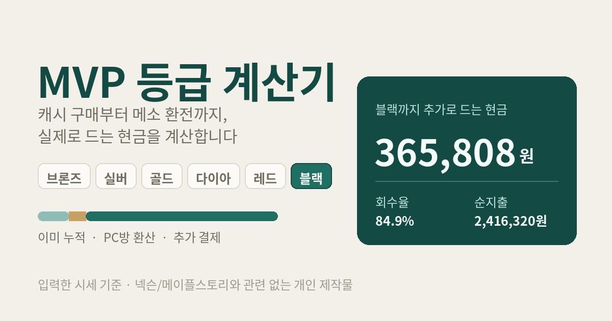

# MVP 등급 계산기

메이플스토리 MVP 등급을 목표로 할 때, 캐시 구매 → 아이템 판매 → 메소 환전까지 거쳐 **실제로 지갑에서 나가는 현금**이 얼마인지 계산하는 웹 도구입니다.

React + TypeScript + Vite로 만든 정적 사이트이며, 서버 없이 브라우저에서 모두 동작합니다.



## 무엇을 계산하나

캐시를 질러 아이템을 사고, 그 아이템을 옥션에 팔아 메소를 받고, 메소를 다시 현금화하면 결제액의 상당 부분이 회수됩니다. 그래서 등급 달성에 드는 실제 비용은 결제 금액이 아니라 **결제액에서 회수액을 뺀 차액**입니다.

```
① 필요 캐시   = 등급 기준 캐시 − 이미 누적된 캐시 − PC방 환산 캐시
② 순지출      = 필요 캐시를 할인 조건 한도에 순서대로 채운 결제액 − 적립액
③ 판매 메소   = (필요 캐시 ÷ 아이템 가격) × 판매 시세
              + (필요 캐시 × 크레딧 적립률 ÷ 필요 크레딧) × 크레딧아이템 시세
④ 회수 현금   = 판매 메소 × (1 − 수수료) × 환전 시세
⑤ 실제 비용   = ② − ④
```

기본값(블랙 250만 캐시, 99,000원 아이템을 49.8억에 판매, 1억당 1,550원 환전) 기준으로 결제액 244만 8천 원 중 205만 원이 회수되어 **실제 비용은 약 36만 6천 원**이 됩니다.

## 주요 기능

- **목표 등급 선택** — 브론즈부터 블랙까지 6단계. 고르면 기준 금액과 옥션 수수료가 함께 바뀝니다.
- **이미 누적된 금액 반영** — 최근 13주 안에 이미 쓴 캐시를 넣으면 남은 금액만 계산합니다.
- **할인 조건 한도 방식** — "6% 할인은 60만까지, 나머지는 1% 할인" 같은 실제 구매 패턴을 그대로 넣습니다. 필요 금액을 위에서부터 채우므로 목표 등급을 바꾸면 조건이 자동으로 다시 배분됩니다.
- **판매 효율 비교** — 캐시아이템 / 크레딧아이템 / 메이플포인트아이템 세 종류를 각각 여러 개 넣으면, 1만 단위 재화당 획득 메소를 계산해 가장 유리한 항목을 ★로 표시합니다.
- **프리미엄PC방 환산** — 시간당 1,000캐시가 MVP 누적에 반영되므로, 현금 없이 목표를 채우는 몫으로 따로 계산합니다.
- **등급별 비용 비교표** — 같은 조건에서 6개 등급의 추가 비용과 유지 비용을 한 번에 보여줍니다. 낮은 등급은 좋은 할인 구간 안에서 해결되므로 캐시당 원가가 더 싸다는 점까지 반영됩니다.
- **손익분기 시세** — 캐시아이템이 몇 억에 팔려야 본전인지.
- **모바일 대응** — 좁은 화면에서는 표가 가로 스크롤 대신 카드로 바뀝니다.
- **입력값 자동 저장** — `localStorage`에 저장되어 다시 열면 그대로 복원됩니다.

## 기술 스택

| 항목 | 선택 | 이유 |
| --- | --- | --- |
| 프레임워크 | React 19 | 입력에 따라 여러 지표가 동시에 바뀌는 화면이라 상태 기반 렌더링이 적합 |
| 언어 | TypeScript | 금액·시세를 다루므로 단위와 `null` 처리를 타입으로 고정 |
| 빌드 | Vite | 설정 없이 빠른 개발 서버와 정적 번들 |
| 테스트 | Vitest | 계산 로직을 UI 없이 검증 |
| 배포 | GitHub Actions → GitHub Pages | 서버가 필요 없는 정적 사이트 |

백엔드를 두지 않았습니다. 모든 계산이 브라우저 안에서 끝나고 저장할 데이터도 없어서, 서버를 두면 관리 비용만 늘어납니다. 시세 자동 조회나 계정 동기화를 붙이는 시점에 추가하면 됩니다.

## 프로젝트 구조

```
src/
├─ lib/                 UI와 무관한 순수 로직
│  ├─ types.ts          도메인 타입
│  ├─ grades.ts         등급 기준 등 게임 사양 상수
│  ├─ calc.ts           계산 함수 (전부 순수 함수)
│  ├─ calc.test.ts      계산 검증 20개
│  ├─ defaults.ts       기본 입력값
│  ├─ format.ts         숫자 표기
│  └─ storage.ts        localStorage 입출력
├─ hooks/
│  └─ useCalcState.ts   입력 상태 관리 + 자동 저장
├─ components/          화면 조각
└─ App.tsx              단계별 화면 구성
```

계산을 `lib/calc.ts`에 순수 함수로 몰아넣어, UI를 띄우지 않고 테스트할 수 있게 했습니다.

## 로컬에서 실행

```bash
npm install
npm run dev        # http://localhost:5173
```

| 명령 | 설명 |
| --- | --- |
| `npm run dev` | 개발 서버 |
| `npm run build` | `dist/`에 프로덕션 빌드 |
| `npm run preview` | 빌드 결과를 로컬에서 확인 |
| `npm test` | 계산 로직 테스트 |
| `npm run lint` | 정적 검사 |

## 배포 (GitHub Pages)

`main`에 push하면 GitHub Actions가 테스트 → 빌드 → 배포를 자동으로 수행합니다. 워크플로는 `.github/workflows/deploy.yml`에 있습니다.

처음 한 번만 아래 설정이 필요합니다.

1. GitHub에서 새 저장소를 만들고 이 폴더를 push합니다.

   ```bash
   git init
   git add .
   git commit -m "MVP 등급 계산기"
   git branch -M main
   git remote add origin https://github.com/사용자명/저장소명.git
   git push -u origin main
   ```

2. 저장소 **Settings → Pages**로 이동합니다.
3. **Source**를 `Deploy from a branch`가 아니라 **`GitHub Actions`** 로 바꿉니다.
4. **Actions** 탭에서 배포가 끝나기를 기다립니다. 2~3분 걸립니다.
5. `https://사용자명.github.io/저장소명/` 에서 열립니다.

이후로는 push할 때마다 자동으로 다시 배포됩니다. 테스트가 실패하면 배포되지 않습니다.

### 커스텀 도메인 (선택)

도메인을 연결하면 주소가 짧아지고 OG 미리보기도 깔끔해집니다.

1. 도메인을 구입합니다 (가비아, Cloudflare Registrar 등).
2. DNS에 아래 레코드를 추가합니다.

   | 형식 | 이름 | 값 |
   | --- | --- | --- |
   | A | `@` | `185.199.108.153` |
   | A | `@` | `185.199.109.153` |
   | A | `@` | `185.199.110.153` |
   | A | `@` | `185.199.111.153` |
   | CNAME | `www` | `사용자명.github.io` |

3. 저장소 **Settings → Pages → Custom domain**에 도메인을 입력합니다.
4. DNS가 퍼지면 **Enforce HTTPS**를 켭니다.

### 링크 미리보기 설정

`index.html`의 `og:url`과 `og:image`가 `https://example.com`으로 되어 있습니다. 배포 주소가 정해지면 이 두 곳을 실제 주소로 바꾸세요. 그래야 카카오톡이나 디스코드에 링크를 붙였을 때 미리보기 카드가 뜹니다.

```html
<meta property="og:url" content="https://사용자명.github.io/저장소명/" />
<meta property="og:image" content="https://사용자명.github.io/저장소명/og-image.png" />
```

## 수정하기 좋은 지점

게임 사양이 바뀌면 `src/lib/grades.ts`만 고치면 됩니다.

| 상수 | 설명 |
| --- | --- |
| `GRADES` | 등급명 · 기준 캐시(`req`) · 기본 옥션 수수료(`fee`) |
| `PC_CASH_PER_HOUR` | 프리미엄PC방 시간당 환산 캐시 (현재 1,000) |
| `WEEKS` | MVP 집계 기간 (현재 13주) |
| `BLACK_CARRYOVER_CAP` | 블랙 초과분 이월 한도 |

기본 입력값은 `src/lib/defaults.ts`, 색상은 `src/index.css`의 `:root` 변수에 모여 있습니다. 저장 구조를 바꿀 때는 `src/lib/storage.ts`의 `KEY` 버전을 올려 옛 데이터와 충돌을 피하세요.

## 등급 기준 (2026년 9월 기준)

| 등급 | 13주 누적 넥슨캐시 |
| --- | --- |
| 브론즈 | 15만 |
| 실버 | 30만 |
| 골드 | 60만 |
| 다이아 | 90만 |
| 레드 | 150만 |
| 블랙 | 250만 |

출처: [메이플스토리 공식 게임정보 — MVP 시스템](https://maplestory.nexon.com/guide/n23gameinformation/articles/425)

등급 기준과 혜택은 변경될 수 있으니 실제 사용 전에 공식 가이드를 확인하세요.

## 계산에 반영되지 않는 것

- 마일리지로 할인받아 결제한 금액은 MVP 누적에 반영되지 않습니다.
- 청약철회가 가능한 아이템은 캐시보관함에서 인벤토리로 옮길 때 누적에 반영됩니다.
- 대량 판매 시 시세가 밀릴 수 있어, 판매가는 평균 체결가를 넣는 편이 정확합니다.
- 아이템 개수를 소수로 계산합니다. 실제 구매는 정수 단위입니다.
- 등급 혜택으로 받는 교환 가능 아이템(경험치 쿠폰, 솔 에르다의 기운 등)의 판매 수익은 넣지 않았습니다.

## 면책

이 도구는 입력한 값으로 산수를 해 주는 계산기이며, 시세를 조회하거나 거래를 중개하지 않습니다. 결과는 입력값에 전적으로 의존합니다.

메소를 현금으로 거래하는 행위는 게임 운영정책상 제재 사유가 될 수 있습니다. 이 저장소는 그러한 거래를 권하지 않습니다.

넥슨 및 메이플스토리와 관련이 없는 개인 제작물입니다.

## 라이선스

[MIT](LICENSE)
